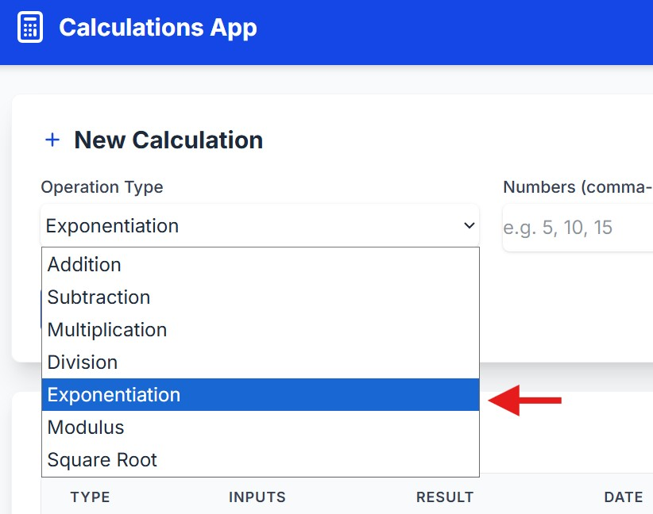

# Calculator Web API

This project is a web-based calculator application built with **FastAPI** that allows users to perform calculations and manage their calculation history. The application includes user authentication, registration, and database-backed calculation history.

### Features

* **Calculations** — Perform mathematical calculations through the web application.
* **User Registration** — Create a new user account.
* **User Login** — Securely log in and access user-specific features.
* **Calculation History (BREAD)** — Manage saved calculation history with **Browse, Read, Edit, Add, and Delete** operations. Users can save calculations, view their history, update existing calculations, and delete calculations.
* **UPDATE: New Operations** — The calculator has been expanded with three additional mathematical operations:

  * **Exponential** — Calculate a number raised to a given power.
  * **Square Root** — Calculate the square root of a number.
  * **Modulus** — Calculate the remainder after division.


---

## Project Structure

```text
FINAL_PROJECT/
├── app/
│   ├── auth/
│   ├── core/
│   ├── models/
│   ├── schemas/
│   └── main.py
├── tests/
│   ├── unit/
│   ├── integration/
│   └── e2e/
├── Dockerfile
├── docker-compose.yml
├── requirements.txt
└── README.md
```

---

## Getting Started

### Prerequisites

Before running the application, make sure you have the following installed:

* Python
* Docker
* Docker Compose
* Git

---

## Installation

### 1. Clone the Repository

```bash
git clone git@github.com:vlee1919/final_project.git
```

### 2. Configure Virtual Environment

```bash
pyenv local 3.10.20
python -m venv venv
source venv/bin/activate
```
---

## Running the Application

### Using Docker Compose

Build and start the application:

```bash
docker compose up --build
```

The application should then be available at:

```text
http://localhost:8000
```

### API Documentation

FastAPI automatically provides interactive API documentation.

**Swagger UI:**

```text
http://localhost:8000/docs
```

**ReDoc:**

```text
http://localhost:8000/redoc
```

---

## Docker Hub

The application has been containerized and published to Docker Hub.

**Docker Hub Repository:**

[Docker Hub Repository](https://hub.docker.com/repository/docker/vl268/final_project/general)

To pull the published image:

```bash
docker pull vl268/final_project:latest
```

---

## API Features

### Authentication

The application provides user authentication through:

* User registration
* User login
* JWT-based authentication
* Protected endpoints for authenticated users

---

## Database

The application uses **PostgreSQL** to store user information and calculation history.

**Database technologies:**

* PostgreSQL
* SQLAlchemy ORM
* Alembic migrations

---

### Run All Tests

```bash
pytest
```


